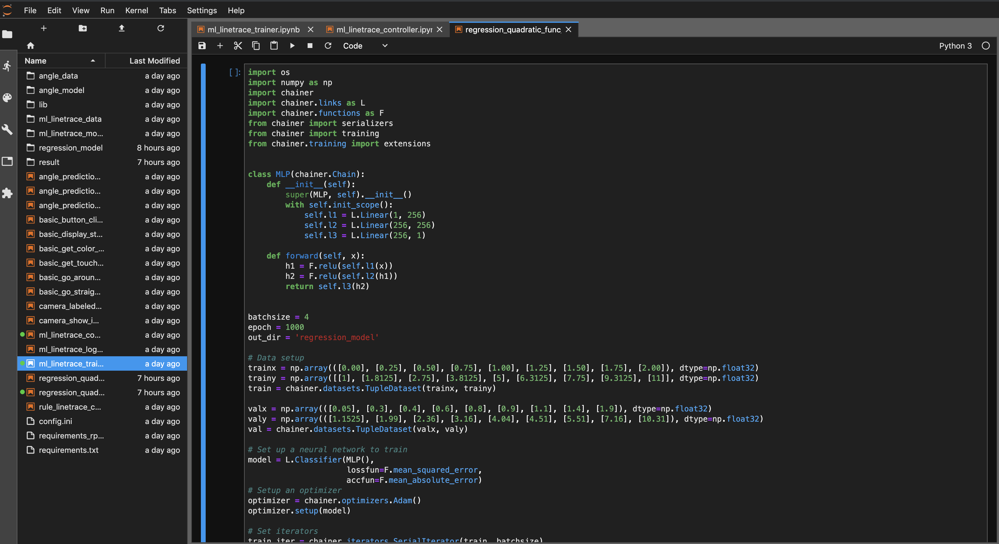
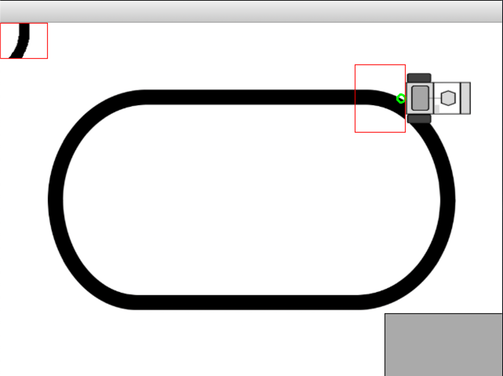
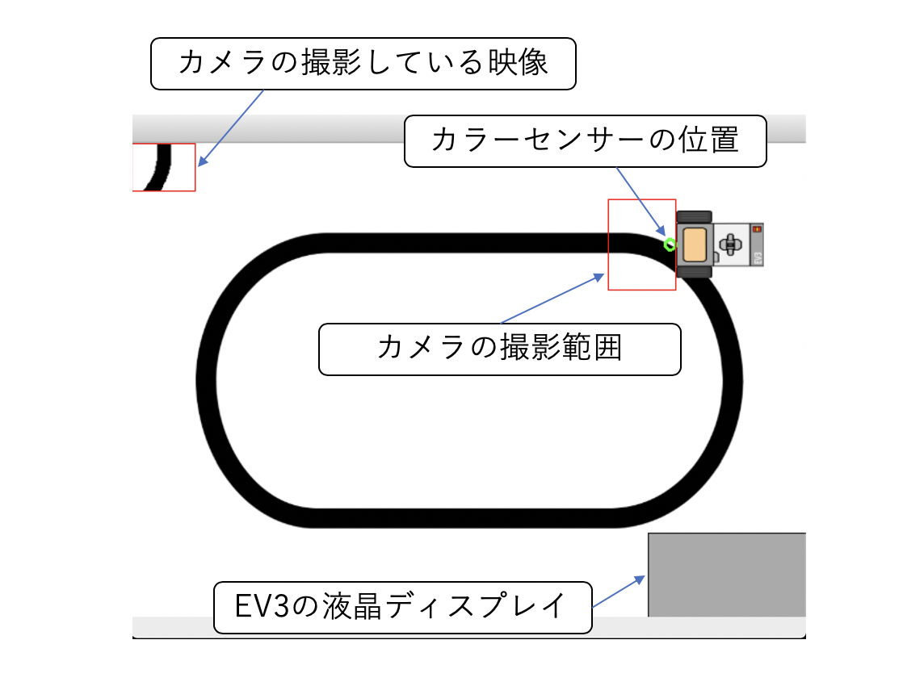
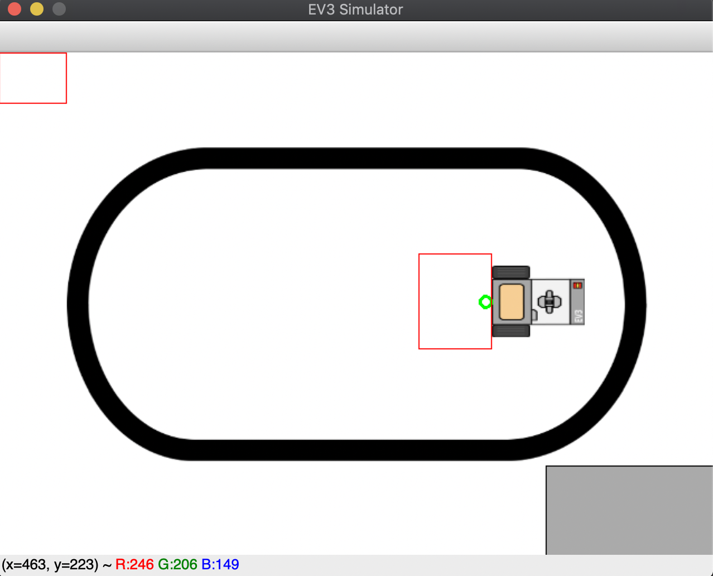
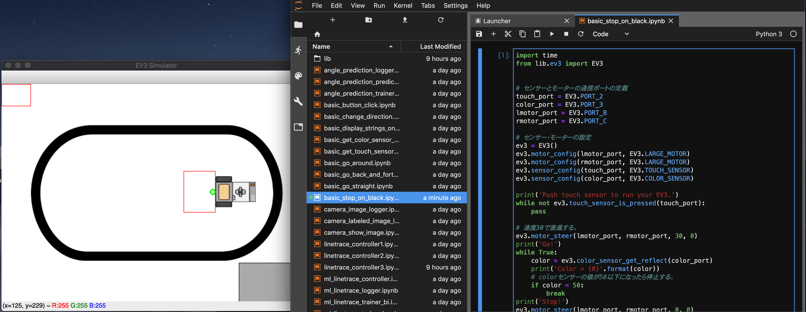
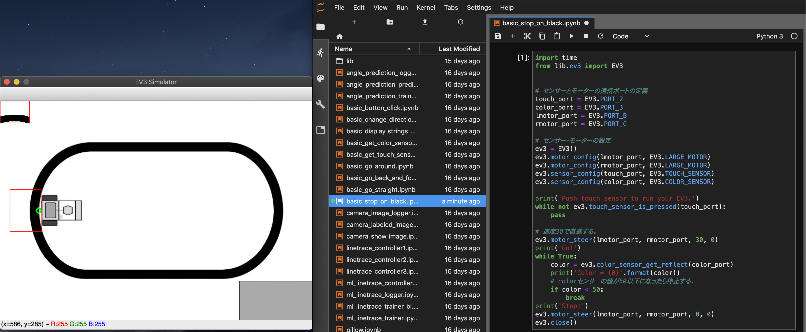

# 概要
`chainer-ev3/simulator2d`ではEV3の２次元シミュレーターを提供します。EV3の動作、カメラ・カラーセンサー・タッチセンサー、EV3上の5種類のボタンのシミュレーションが可能です。

# シミュレーターのセットアップ方法
## 事前準備
- Python, pipコマンドが使える環境でコンソールを開いてコマンドラインベースでセットアップを行います。
- gitがインストールされていない場合はインストールを行ってください。

- pyenvのセットアップ
  ```
  $ git clone https://github.com/yyuu/pyenv.git ~/.pyenv
  $ echo 'export PYENV_ROOT="$HOME/.pyenv"' >> ~/.profile
  $ echo 'export PATH="$PYENV_ROOT/bin:$PATH"' >> ~/.profile
  $ echo 'eval "$(pyenv init -)"' >> ~/.profile
  ```

- pyenv-virtualenvのセットアップ

  ```
  $ git clone https://github.com/yyuu/pyenv-virtualenv.git ~/.pyenv/plugins/pyenv-virtualenv
  $ echo 'eval "$(pyenv virtualenv-init -)"' >> ~/.profile
  ```

- Python3のセットアップ

  Python3.6.8をインストール。
  ```
  $ source ~/.profile
  $ pyenv install 3.6.8
  ```
  
- レポジトリのクローンとpython仮想環境の構築
  ```
  $ git clone git@/pfnet-research/chainer-ev3.git
  ```

## サンプルコードを動作させるためのpython環境のセットアップ
- pythonの必要パッケージを仮想環境にインストールします。
  ```
  $ cd chainer-ev3/workspace
  $ pyenv virtualenv 3.6.8 chainer-ev3
  $ pyenv local chainer-ev3
  $ pip install --upgrade pip
  $ pip install -r requirements-sim.txt
  ```
  ※ pipでインストールするファイルは`workspace/requirements.txt`ではないことに注意してください。

- JupyterLabを起動します。
  ```
  $ cd ~/chainer-ev3/workspace
  $ jupyter lab
  ```
  次のようなウインドウがブラウザに出てきたらセットアップ成功です。
  
  
## シミュレーターのセットアップ
- JupyterLabを起動したコンソールとは別のコンソールを立ち上げて作業を行います。
- シミュレーターのセットアップを行います。 
  ```
  $ cd chainer-ev3/simulator2d
  $ pyenv virtualenv 3.6.8 simulator2d
  $ pyenv local simulator2d
  $ pip install -r requirements.txt
  ```
  
- シミュレーターを起動します。
  ```
  $ python main.py
  ```
  以下のような画面が出てきたら成功です。
  
  
 
## コンフィグファイルの変更
初期設定ではJupyterLabで動作させるコードは実機のEV3と接続するように設定されています。`workspace/config.ini`の内容を修正することで、接続先をシミュレーターに変更します。
- コンフィグファイルの設定をシミュレーター接続のものに変更します。
  ```
  $ cd chainer-ev3/workspace
  $ cp config-sim.ini config.ini
  ```
  ※TCP/IP通信を利用するため、環境によっては`config.ini`を直接編集してポート番号を変更する必要があります。
  
- 実機接続に戻す場合は以下のコマンドを実行します。
  ```
  $ cd chainer-ev3/workspace
  $ cp config-real.ini config.ini
  ```

# シミュレーターの使い方
## シミュレーターのウインドウの解説
  

- カラーセンサーの位置（EV3前方の緑円）: 緑円の範囲の地面の反射値をシミュレーションします。
- カメラの撮影範囲（EV3前方の赤矩形）: 赤矩形の範囲の地面の画像を撮影します。
- カメラの撮影している映像（画面左上の矩形）: カメラの撮影している映像をシミュレーションします。
- EV3の液晶ディスプレイ（画面右下の矩形）： EV３のディスプレイの状態をシミュレーションします。

## ウインドウ上でのシミュレーターの操作方法
シミュレーターのウインドウ上でマウスとキーボードを用いてシミュレーター上のEV3の位置やセンサーの状態などを操作することが可能です。
- 左クリック: クリックした位置にEV3を移動させます。
- `SHIFT`+左クリック: EV3を時計回りに10度回転させます。
- `ALT`+左クリック: EV3を反時計回りに10度回転させます。
- `t`: タッチセンサーを押します。
- `r`: シミュレーターを初期状態に戻します。
- `0`: Enterボタンを押します。
- `1`: Leftボタンを押します。
- `2`: Rightボタンを押します。
- `3`: Upボタンを押します。
- `4`: Downボタンを押します。
- `q`: シミュレーターを終了させます。

## サンプルコードの動作例
ここでは、EV3のタッチセンサーを押すことで走行を始め、カラーセンサーが黒の上に来たら走行を停止するサンプルコード`basic_stop_on_black.ipynb`を動かしてみます。

1. シミュレーターのウインドウを立ち上げ、マウス操作でEV3を次のようにコースマップの中心付近の位置に移動させます。

    

2. ブラウザで開いたJupyter Labの左側のリストから`basic_stop_on_black.ipynb`を選択します（以下の画面を参考）

    

3. Jupyter Lab上で`basic_stop_on_black.ipynb`の実行を行います。（セルを選択して、SHIFT+ENTERか、UI上の実行ボタンをクリックしてください。）
4. シミュレーターのウインドウ上で、`t`ボタンを押します。走行が開始され、黒線の上で停止することを確認してください。

    
    
5. キーボードの`r`ボタンを押すことで初期状態に戻ります。

# コースマップの変更方法
コースマップを置き換えることで自作のコースを利用することが可能です。

TODO

# トラブルシューティング
TODO
